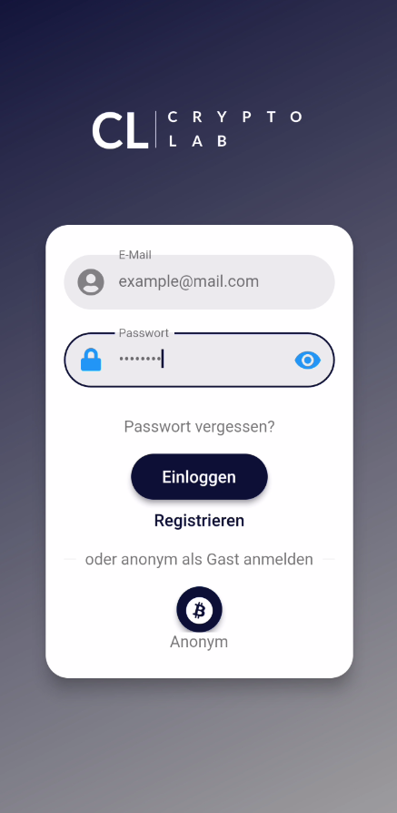
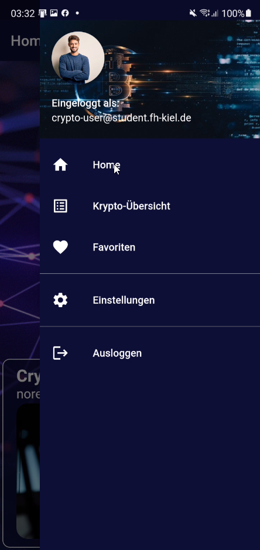
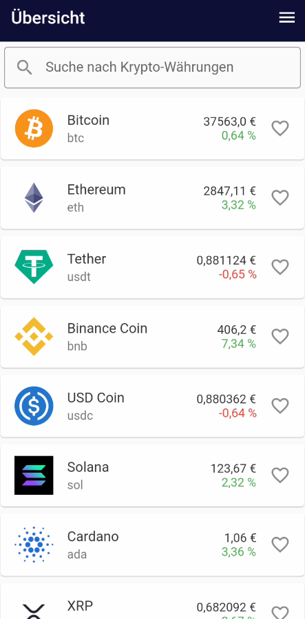
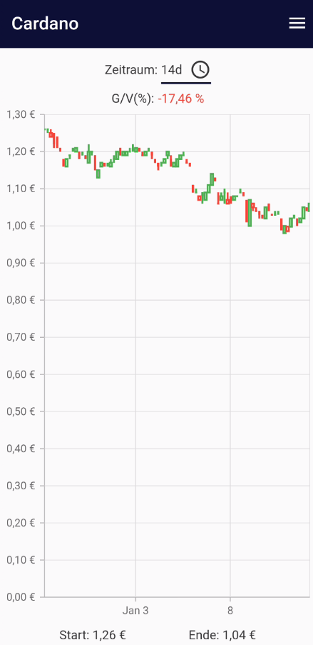

Crypto-Lab ist eine crossfunktionale Handy-Applikation, die es dem Nutzer ermöglicht, an Informationen rund um das Thema Kryptowährungen zu gelangen.

## Projekt-Beschreibung

<p>Die App stellt dem Nutzer zu den größten Kryptowährungen nach Marktkapitalisierung Auskünfte zu Preisen und historischen Kursverläufen bereit.</p>
<p>Um in der Welt der Kryptos immer auf dem aktuellem Stand zu bleiben, können innerhalb der App direkt relevante Nachrichten abgerufen werden.<br/>
Für einen besseren Überblick und die eigene Individualisierung sorgt das Hinzufügen der Lieblings-Kryptowährungen zu Favoriten, die gesondert innerhalb einer
Favoritenliste betrachtet und gewählt werden.</p>

### Kernfunktionalitäten:

- Login & Registrierung
- Darstellung einer Gesamt-Übersicht aller Kryptos
- Abruf von Krypto-bezogenen Nachrichten
- Preis-Charts nach Zeiträumen
- Favoritenliste (nur für registrierte Nutzer)
- Einstellungen (nur für registrierte Nutzer)

## Quickstart-Guide & Funktionen

#### Login & Registrierung

<p>Die App ist in einem Gast und einem User-Modus benutzbar. Möchte man in die App hineinschnuppern, so genügt beim Login ein einfacher Klick auf den
unteren "Anonym"-Button. Für die Nutzung aller Funktionen ist eine Registrierung erforderlich. Bei vergessenem Passwort lässt sich dieses durch Zuschicken einer E-Mail zurücksetzen.
</p>


#### Startseite & News

<p>Nach erfolgreicher Anmeldung befindet man sich auf der Startseite. Dort sind allerlei News zu Krypto-Themen auffindbar. Die News lassen sich zusätzlich durch Kipp-Bewegungen des Handys nach rechts oder links durchscrollen.
</p>

#### Navigation

<p>Die Navigation durch die App erfolgt durch einen Klick auf das überall erreichbare Menü-Icon am oberen rechten Rand der App. Auch durch einen Swipe vom rechten App-Rand öffnet sich das Navigationsmenü.
</p>

#### Gesamt-Übersicht aller Kryptos

<p>Durch einen Klick auf "Krypto-Übersicht" erhält man eine geordnete Liste aller Krypto-Währungen. Eine Suche lässt den Nutzer schnell bestimmte Währungen finden. Einzelne Kryptos können durch einen Klick auf das Herz-Icon den Favoriten hinzugefügt werden.
</p>

#### Kursverlauf einer Krypto-Währung

<p>Klickt man innerhalb der Favoriten- oder Krypto-Übersicht auf eine bestimmte Coin, so erhält man ein Candle-Chart. Dieses lässt sich auf bestimmte Zeiträume anpassen.
</p>

#### Favoriten (nur für registrierte Nutzer)

<p>In den Favoriten findet man seine Lieblings-Kryptos wieder. Durch einen Klick auf das Mülleimer-Symbol lassen sich Kryptos aus den Favoriten wieder entfernen</p>

#### Einstellungen (nur für registrierte Nutzer)

<p>In den Einstellungen kann der Nutzer das Passwort ändern und hat die Möglichkeit, den eigenen Account zu löschen.</p>

## Code-Aufbau

### Genutzte Tools & APIs:

- Flutter (aktuell 2.5)
- Firebase (https://firebase.google.com/)
- CoinGecko API (https://www.coingecko.com/en/api)
- News API (https://newsapi.org/)

### Struktur

#### MVC-Pattern

- Die Library ```model``` beinhaltet alle Klassen, die Objekte abbilden. Dabei handelt es sich um reine Daten-Klassen. Die Attribute der
  Klassen ```crypto```, ```ohlc``` und ```articles``` werden nur auf Grundlage der API-Calls gesetzt.
- Die Library ```controller``` beinhaltet alle Service-Klassen, die Berechnungen, Validierungen, API-Calls etc. durchführen. Dazu zählen unter anderem
  der `AuthenticationService`, der alle Funktionen rund um den Login & die Registrierung bereitstellt oder den `CryptoNewsApiService`, welcher die
  Nachrichten aus der News API fetcht. Alle Controller-Klassen sind als Singleton realisiert.
- In der Library ```view``` befinden sich dementsprechend die Widget-Builder. Innerhalb dieser Library haben wir eine weitere Package-Strukturierung
  nach eigen erstellten Widgets oder den verschiedenen Routen vorgenommen.

#### Routing
...

#### Firebase Authentication
...

#### Firebase Firestore
CRUD: create, read, update und delete Kryptowährungen mit Firebase

#### Eigene benutzerdefinierte Widgets

Häufig verwendete Widgets und Farben haben wir modularisiert und für verschiedene Aufruf-Szenarien verfügbar gemacht. ... Dadurch haben wir eine sehr
gute Grundlage für mögliche Weiterentwicklungen geschaffen (z.B. CustomPopup, CustomSnackbar, CustomColors).